<div align="center">


<a href="{{GITHUB_URL}}">

</a>

<br/>

[]({{LINKEDIN_URL}})
[](mailto:{{EMAIL}})
[]({{PORTFOLIO_URL}})
[]({{GITHUB_URL}})
[]({{GITHUB_URL}})

</div>

<br/>

## 👋 About Me

```json
{
  "name": "{{NAME}}",
  "day_job": "{{HEADLINE}} @ Cognizant",
  "night_job": "Building AI tools with cultural relevance for India",
  "based_in": "{{LOCATION}}",
  "years_experience": {{YEARS_EXPERIENCE}},
  "philosophy": "{{PHILOSOPHY}}",
  "currently_exploring": ["Agentic AI", "Multi-agent orchestration", "MCP servers"]
}
```

By day, I design test strategy and automation frameworks that keep retail-scale software honest. By night — and at every hackathon I can find — I build GenAI products named in Hindi and Sanskrit, made for people who don't always see themselves reflected in AI products: exam-stressed students, home cooks, first-time voters, and soon, a stadium full of football fans.

<br/>

## 🛠️ Tech Stack

<div align="center">

**Automation & Testing**
<br/>
{{SKILLS_TESTING}}

**AI / GenAI Stack**
<br/>
{{SKILLS_GENAI}}

**Languages, CI/CD & Tools**
<br/>
{{SKILLS_CORE}}

</div>

<br/>

## 🎯 GenAI Builds — Hackathons & Weekend Projects

{{GENAI_PROJECTS_TABLE}}

<br/>

## 🧪 QA Engineering — Frameworks & Playbooks

{{QA_PROJECTS_TABLE}}

<br/>

## 🏆 Professional Impact

| Achievement | Impact |
|---|---|
{{ACHIEVEMENTS_TABLE}}

<br/>

## 📊 GitHub Stats

<div align="center">


</div>

<div align="center">

</div>

<sub>Generated once a day by <code>update-stats.yml</code> using <a href="https://github.com/stats-organization/github-readme-stats-action">github-readme-stats-action</a> and <a href="https://github.com/DenverCoder1/github-readme-streak-stats">github-readme-streak-stats</a> — both run inside this repo's own GitHub Action and commit static SVGs, so there's no live third-party endpoint to go down.</sub>

<br/>

<div align="center">

### 🐍 Contribution Snake

<picture>
  <source media="(prefers-color-scheme: dark)" srcset="https://raw.githubusercontent.com/MuskaanTimbadiya/MuskaanTimbadiya/output/github-snake-dark.svg" />
  <source media="(prefers-color-scheme: light)" srcset="https://raw.githubusercontent.com/MuskaanTimbadiya/MuskaanTimbadiya/output/github-snake.svg" />
  
</picture>

<sub>Animated from real contribution history via <code>snake.yml</code>.</sub>

</div>

<br/>

## 🚧 Currently Building

{{CURRENTLY_BUILDING}}

<br/>

## 🤝 Let's Connect

I'm always up for a conversation about test automation, GenAI for underserved use cases, or the next hackathon idea.

<div align="center">

[]({{LINKEDIN_URL}})
[](mailto:{{EMAIL}})
[]({{PORTFOLIO_URL}})

</div>


